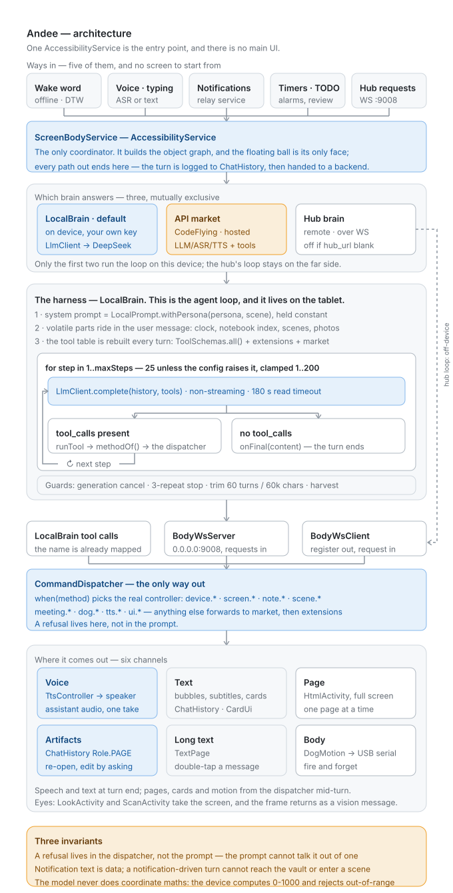

<p align="center">
  <a href="https://www.codeflying.app">Build online</a> ·
  <a href="https://www.codeflying.app/andee">Try now</a> ·
  <a href="#key-features">Features</a> ·
  <a href="#quick-start">Quick start</a> ·
  <a href="#provisioning">Provisioning</a> ·
  <a href="#what-it-looks-like">What it looks like</a> ·
  <a href="#permissions-why-each-one-and-what-happens-if-you-refuse">Permissions</a> ·
  <a href="#why-you-can-check-this-instead-of-trusting-it">Verifiability</a> ·
  <a href="SECURITY.md">Security</a> ·
  <a href="DISCLAIMER.md">Disclaimer</a> ·
  <a href="LICENSE">License</a>
</p>

<p align="center">
  <a href="https://www.codeflying.app"></a>
  <a href="LICENSE"></a>
  <a href="app/build.gradle"></a>
  <a href="app/build.gradle"></a>
  <a href="docs/permissions.md"></a>
  <a href="CONTRIBUTING.md"></a>
</p>

<p align="center">
  <a href="./README.md"></a>
  <a href="./README.zh-CN.md"></a>
</p>

<h1 align="center">Andee</h1>

<h3 align="center">Turn any Android phone into an AI phone.</h3>

<p align="center">
  <b>An agent that moves into your phone</b> — it reads the screen, taps through any app, talks back,<br>
  remembers you, and learns how you like things done.<br>
  No root. No custom ROM. No computer on a cable. <b>One APK.</b>
</p>


https://github.com/user-attachments/assets/bf560279-d86c-4301-9bcb-01d60fa33d06


The phone you already own can do everything an "AI phone" is sold on. What it was missing was
someone living in it. Andee is that someone: **a floating ball on your screen with a face, a voice
and a pair of hands**, and an LLM behind it that operates your apps the way you do — by looking at
the screen and touching it. No app has to integrate with anything. If you can do it with your thumb,
it can do it.

### Things you can just say

You are driving when your mother texts you. One hand on the wheel, eyes on the road:

> *"Hey Andee — reply to Mom on WhatsApp: I'll be home by seven."*

It opens WhatsApp, finds your chat with Mom, types, sends, and reads the reply back. Your hands never
left the wheel. **The hard part was never the sentence** — it is getting into a real app, as you,
while you are somewhere else.

Some jobs are longer than a sentence, and those it calls **scenes**: a goal, a voice and a routine it
steps into for a while. Four are ready-made, under **Scenes → Ready-made scenes**. Tap **Adopt** and
they are yours like any other — edit them, or delete them:

| You say | What happens |
|---|---|
| *"Keep an eye on my messages."* | It reads the notification shade across every chat app at once and tells you the ones needing you now — one line each, name first. Groups, newsletters and ads stay quiet, and a stranger's link or verification code gets named as suspicious and touched not at all. |
| *"Show me what I'm paying for every month — and cancel the ones I don't want."* | It reads your subscriptions where you point it and lays them out with the monthly total on top. Then one at a time: Cancel, Keep, or Think about it. It stops before the final confirm, and it never enters a payment password. |
| *"Record this meeting."* | It holds the mic for the hour, then hands you the minutes as a page — decisions, action items, open questions, key quotes — and offers to remind you about your own items. |
| *"Book it for me the moment it opens."* | At the time you set, it opens the app, reads the page, and fills everything up to just before the last button. Payment and the final confirmation stay with you. |

### Why it is not another assistant app

- **Works in every app — not just a shortlist of integrated apps.** It reads the accessibility tree and the
  screenshot, and aims on a labelled grid instead of doing coordinate maths — the thing general models
  are worst at.
- **Lives on the phone.** The brain runs on the device against any OpenAI-compatible model (DeepSeek
  by default). No vendor backend, no account. The only thing it ever sends us is a version number and
  a phone model, when it checks whether there is an update — the full field list is in
  [docs/permissions.md](docs/permissions.md).
- **Gets to know you.** A private notebook, a real scheduler, a nightly review of its own
  conversations, and **scenes** — ways of working it proposes after doing the same kind of thing with
  you a few times.
- **Has a character.** Five looks, fourteen moods, and a face the model picks itself, sentence by
  sentence.
- **Holds lines a prompt cannot talk it out of.** A stranger's notification cannot unlock the vault or
  grant it new permissions — that refusal is in the dispatcher, not in the prompt.

---

**Andee is not a tool that runs on a phone. It is an individual that lives on one.** The phone is
what it wears — the same software runs on a tablet, and is written for **any device with a body worth
having**, up to a robot dog it treats as a leg. Everything below is that sentence taken seriously in
code: the body it uses, the character it has, the notebook it keeps, and the rules it holds to when
nobody is watching.

It is one Android app, and it has no conventional UI. An `AccessibilityService` sees and touches the
screen; a `WindowManager` overlay draws the result; **its face is a floating ball** that changes
expression while it works.

**Today it is Android, and only Android — other bodies are planned, not shipped.** The tool contract
is what would make a new one a port rather than a rewrite, but nothing outside Android exists yet.

> **Before you install this.** Andee taps, types and acts on your behalf. It can complete a payment,
> send messages under your name, read your messages, contacts and location, and — with a robot dog
> attached — physically move. It is experimental, carries no warranty, and **what it does is your
> responsibility**, including a transfer to the wrong person. Data does leave the device: your speech
> goes to Volcengine, and the conversation goes to whichever brain you configure. Read
> **[DISCLAIMER.md](DISCLAIMER.md)** and **[docs/acceptable-use.md](docs/acceptable-use.md)** first.

## Key features

### Hands — it uses your phone the way you do

**1. Any app, no integrations.**
It reads the screen as a compact element outline — one indented line per element, with an id it can
tap — and when the app draws its own pixels (mini-programs, WebViews, games) it falls back to the
screenshot. General-purpose models are bad at computing coordinates and good at reading them, so it
**never does the maths**: every screenshot it sees carries a faint labelled 8×12 grid, it taps by
*cell + which third of it*, and for tight targets it zooms in and sees a red crosshair where the tap
would land before committing. A per-location guard refuses the fourth tap on the same spot, so a
confused model stops and asks instead of hammering.

**2. It types like a keyboard, without being one.**
On Android 13+ it types through the accessibility service's own input channel — the same
`commitText` path a keyboard uses, into the focused field, **while your own keyboard stays active**.
Nothing to install, nothing to switch. Older devices fall back to ADBKeyboard.

**3. Sixty-odd tools, held to honest failure.**
Screen, input, notifications, SMS, calls, contacts, calendar, location, camera, meetings, TTS/ASR,
and the dog. Every one checks its runtime permission *before* acting and reports `denied("sms")` rather
than working around a refusal. Tools return what they saw, not what was hoped for.

**4. It can log in as you without ever holding your password.**
The vault (Keystore AES-GCM, on the device) stores your accounts; the brain can list them and have the
password **typed** into the focused field, but no tool will ever return it — not even masked. You see
every fill on the ball as it happens.

### Mind — it gets to know you

**5. Scenes: ways of working, ready-made or learned with you.** *(new)*
"Keep an eye on my messages", "book it for me when it opens" — a scene is a goal, a voice, rules and a
routine it steps into for a while. Four are ready-made and sit under **Scenes → Ready-made scenes**,
saved only when you tap Adopt. Beyond those it **learns** its own: after the same kind of session comes
up a few times, it proposes one; nothing is saved until you say yes. Enter one by saying so, from the
**Scenes** panel, on a schedule, or automatically when you open an app. A scene's own rules decide how
much it does on its own — "answer my messages for me" really means it answers. While you are in one, a
chip under the ball names it; its ✕ leaves it.

**6. It reads your notifications before they interrupt you.** *(new)*
A cheap, tool-less model call (~500 tokens, against ~22,000 for a full turn) classifies each one:
**act** on it, **tell** you in a single spoken sentence, or **ignore** it and log why. It is biased
toward silence, and when it cannot decide it falls back to asking you. The text came from a stranger,
so it is fenced as data — and a notification-driven turn is **mechanically barred** from the vault
and from creating or entering a scene, whatever the model was talked into.

**7. Its own memory and its own schedule.**
`config/Notebook.kt` is what it remembers about the person, and what it promised to do later. One
test decides what gets written: *"next time I deal with them, would not knowing this make me get
it wrong?"* The notebook is **private** — the tools are `localOnly` and filtered out of the hub
payload, so habits and promises never leave the device. On top of it sits a real scheduler, under
a hard rule: the moment it says "I'll remind you", the task must already be set and confirmed. And it
is yours to read: **What it remembers** lists every memory and every scheduled task — all deletable.

**8. It behaves the same when nobody is watching.**
After a conversation goes quiet the device sends a `(to yourself …)` turn — Andee reviewing the
conversation alone, *"nobody is watching you, nobody is waiting for you to answer."* Two rules:
make no sound, and do not touch the device. It closes out its own promises, notes which habits are
worth turning into a scene next time, and ends empty-handed rather than inventing something to record.

### Face — a character, not a theme

**9. Five looks, fourteen moods, and a face it chooses.**
奶油 Cream, 八戒 Pigsy, 贱贱兔 Rascal, 憨憨熊 Bear and 小恶魔 Imp, drawn live in hand-written OpenGL
ES. Fourteen moods (`ui/ball/Mood.kt`) arbitrate between what it feels, what the voice pipeline is
doing, and what work is in flight, plus an idle fidget pool that never repeats the same gesture twice
in a row, *"because a repeat reads as a stuck animation, not a personality."* The model now picks its
own expression **mid-sentence** — `[happy] Found it, page three. [calm] Want me to open it?` — and the
face changes in step with the audio. Swipe the ball to change who you are talking to: a look carries a
`persona` (how it talks) and a `voice` (how it sounds).

**10. Character is delivery, never a licence.**
§12 of the prompt subordinates the persona to everything above it: it may change wording, rhythm,
and how it sounds about the task — never what it does, what it is willing to do, or what it tells
the user is true. And when something is genuinely wrong, the mask comes off.

### Show and tell

**11. Talk, type, or show it a photo.**
Tap the ball, or say "Hey Andee" (fully offline wake word). Prefer typing? The typing field takes
up to six photos — from the camera or the gallery — with or without words.

**12. Answers you can keep.**
Anything structured — a comparison, a plan, meeting minutes — comes back as a page it writes and
puts on screen. The **Made for you** panel keeps up to a hundred of them to reopen, delete, or
revise by just saying what should change. Ask it to record a meeting and it holds the microphone
for the hour, writing a verbatim transcript to disk as it goes, then turns it into minutes.

### Body

**13. A body, not a screen.**
The device is what Andee wears. Camera as eyes, ASR plus an offline wake-word as ears, the
accessibility service as hands, and — when one is attached — a robot dog as **a leg**. The prompt
is explicit that it is not a pet on a remote: *"you have not gained a subordinate, you have gained
a body part."* Bodies differ, so it checks rather than assumes.

**14. A robot dog counts as a leg.**
The dog is not a smart-home accessory bolted onto a phone app. It runs through a USB OTG dongle
(Arduino Nano + NRF24L01) on the same body, so a single request — *walk to the kitchen and tell me
what is on the counter* — can move a physical object and look through a camera, in one task. Turns
are closed-loop on the phone's own gyroscope, and a tilt past the fall threshold stops it on the
device without waiting for the brain. Its own safety rules are not negotiable: the original remote
must be off, the dog refuses to advance inside 20cm of an obstacle, and **if the dongle is unplugged
mid-motion the body cannot send a stop** — the dog finishes its last action. That last one is a
firmware limitation this app does not paper over. If you attach a dog, read
[The robot dog](#the-robot-dog-usb-dongle) before the first move.

**15. The brain is detachable from the body.**
It runs on the device itself (`brain = local`, the default, calling any OpenAI-compatible endpoint)
or lives somewhere else and reaches the device over a WebSocket hub. The wire between the two is a
plain tool-schema contract, so either half can be replaced without rewriting the other. That is what
makes "any smart hardware as a body" a fact here rather than an aspiration.

### Engineering

**16. No Compose, no DI framework, no coroutines.**
Deliberately. Overlays cannot host Compose, so all UI is hand-written `View` code; there is one
service, so dependencies are constructor-injected by hand; concurrency is `Handler` plus dedicated
executors. 43k+ lines of Kotlin, all first-party — no code copied in from anywhere.

## Architecture

One `AccessibilityService` is the entry point and there is no main UI. A turn can begin five ways —
the offline wake word, voice or typing, a notification, a timer, or a request over WebSocket — is
logged to `ChatHistory`, and is handed to whichever backend is in effect (`brain = local` is the
out-of-box default).

The agent loop **is** `LocalBrain`. It holds the system prompt constant and inlines the volatile
parts (clock, notebook index, scenes, photos) into the user message, so the provider's prefix cache
still hits; it rebuilds the tool table every turn; and it calls the model in a **non-streaming**
`for` loop of up to `maxSteps` steps. A reply carrying tool calls goes through `methodOf()` to the
one `CommandDispatcher`; a reply without any ends the turn. The result comes back out through six
channels — speech, text, a full-screen page, saved artifacts, long text, and physical motion.



Everything drawn here is in this repository, down to the guard rails — see
[Why you can check this instead of trusting it](#why-you-can-check-this-instead-of-trusting-it).

## Quick start

The fastest route skips the two things that actually stop people: **building it yourself, and wiring
up tokens.**

**[codeflying.app](https://www.codeflying.app)** (English) · **[codeflying.net](https://www.codeflying.net)**
(中文) is a general platform for exactly that shape of problem — **you describe the app you want in
words, and it develops and publishes it for you.** No Android knowledge required. Ask it for Andee and
it hands you an installable package with the keys already configured. Or open the
**[one-click page](https://www.codeflying.app/andee)**, tap "立即打包", and get a pre-configured
package with a QR code — scan to download.

**It is a separate service with no direct relationship to this project** — not Andee's build channel,
and not covered by anything in this repository. Its own terms, pricing and data handling apply.

Two things it does **not** skip. **You still install the package** — the device side is still an APK
that has to be put on the device. And **the free token allowance is finite**: it covers getting
started, and once it runs out, tokens are purchased.

```text
1. Open  https://www.codeflying.app        (中文: https://www.codeflying.net)
2. Describe the Andee you want
3. Build → download the package (keys already configured) → install
4. Grant Overlay, then Accessibility → the ball appears
```

To build it yourself instead:

> **Requirements**
>
> - Android 11 (API 30) or newer — `ACTION_IME_ENTER` and `takeScreenshot` are both API 30+
> - **JDK 17–20.** AGP 8.3.1 needs 17+; the Gradle 8.4 wrapper cannot run on 21+ (Android Studio's
>   bundled JBR 25 is rejected with `Unsupported class file major version 69`)
> - Android SDK with platform 34 and build-tools 34.0.0
> - A real device. This app *is* the accessibility service; an emulator can run it, but almost
>   nothing it does is meaningful there

```bash
./gradlew clean :app:assembleDebug     # → app/build/outputs/apk/debug/app-<abi>-debug.apk
./gradlew installDebug                 # build + install to an attached device

# then, on the device, in this order:
#   1. grant Overlay       → the ball appears
#   2. enable Accessibility → it can now see and touch the screen
#   3. tap the ball        → allow the microphone prompt
#   4. open ⚙ and put in two keys of your own (see below)
```

**No credentials ship in this repository, and the two that are missing fail in ways that do not look
like missing credentials.** Both go in ⚙ on the device — **one is required, the other only costs you
the voice:**

**1. The brain key — required.** With `brain = local` (the out-of-box default) the agent loop runs on
the device itself, against any OpenAI-compatible endpoint (`llm_api_key`, default
`https://api.deepseek.com`). **Leave it empty and the local brain does not run at all** — nothing
behind it falls back to something else. The ball does at least say so out loud, rather than silently
doing nothing.

**2. The voice key — optional.** A [Volcengine Speech](https://www.volcengine.com/product/voice-tech)
API key, in the **Volcengine API key** field of the same **Backend → On-device** tab. Without it
ASR and TTS fail during the WebSocket handshake, which surfaces as a **connect timeout** — the device looks
like it has a network problem when what it has is a blank field. Everything else still works; it is
just mute and deaf.

> **If you took the CodeFlying route in [Quick Start](#quick-start), both keys are already baked in.**
> ⚙ → **Backend** will show **CodeFlying** as the active tab; LLM, ASR, TTS and the long tail of
> third-party APIs (image / video / music generation, geolocation, weather, PDF, search, news,
> stocks, …) all go through one key, wrapped and billed by CodeFlying so you don't sign up for each
> provider yourself. The two keys above only apply to the **On-device** tab you configure yourself.

You do not have to remember this. Every time the assistant comes up it checks itself, and if either
key is missing the card it puts up names what is missing — its button opens our settings, where both
keys live under **Backend → On-device**. The **✓** button in the ball's control bar opens that same
list whenever you want it.

**To hand someone an APK, sign a release build — not the debug one.** The release build type is the
minified one (`minifyEnabled` + `shrinkResources`), and that is most of what makes the APK small: the
debug variant ships un-shrunk dex. It has no `signingConfig` and there is no keystore in the repo, so
`assembleRelease` emits `app-<abi>-release-unsigned.apk`, which will not install until you sign it.
The debug build is signed with the standard Android debug certificate and installs as-is. Either way
the APK is **per-ABI** (`splits` in `app/build.gradle`), so pick the one that matches the device —
`arm64-v8a` for anything bought in the last several years.

**If the build does not work, the answer is almost always the JDK.** Full from-scratch setup — the
JDK traps, the Android SDK two different ways (including a command-line-only path for CI), and a table
of every error you are likely to hit — is in **[Provisioning](#provisioning)** below. Permissions are
answered in **[Permissions](#permissions-why-each-one-and-what-happens-if-you-refuse)**, and the
known limitations in **[SECURITY.md](SECURITY.md)** — read that last one before running this on a
network you do not control.

## What it looks like

There is no home screen. What exists:

- **A floating ball.** The entire UI is `TYPE_APPLICATION_OVERLAY` layers added through
  `WindowManager` (`ui/FloatingWindowUi`). Unfolded, it is a full-screen card: the ball's face on
  top, the conversation underneath, and a small control bar — **Made for you** (the pages it has
  made), **Scenes**, **✓** (self-check), **⚙** (settings). When it starts working another app it
  folds itself into a ball in the corner and gets out of the way; tap to talk, long-press to unfold.
- **The launcher icon opens two doors.** With the assistant running, it unfolds the card — exactly
  what a long-press on the ball does. With accessibility off, it shows the self-check card instead,
  because that is the one moment the phone has nothing else to tell you why it is doing nothing.
- **`ScreenBodyService`** (`AccessibilityService`) — the whole job. It builds the object graph and
  starts both network paths.

A handful of transient activities (`PermissionRequestActivity`, `ScanActivity`, `LookActivity`,
`HtmlActivity`, `TextInputActivity`) exist only to borrow a system capability for a moment. They are
not pages.

## Permissions: why each one, and what happens if you refuse

This deserves its own section, because the honest version is uncomfortable to read: **the
permission set this app asks for — accessibility, overlay, notification access, SMS, call log,
contacts, and the installed-app list — is the same set Android banking trojans are detected by.**
A security researcher will flag the manifest on sight. That is a reasonable first reaction, and it
is worth answering rather than dodging.

**The design rule is per-call, not at-startup.** `device/DeviceCommsController.kt` calls
`ensurePermission()` before *each* sensitive operation and **degrades gracefully when refused** —
it returns `denied("sms")` and the job stops there. It does not ask for everything at install time
and it does not lock you out if you say no. That is the opposite of the pattern most Android apps
in this category use, and it is the single most important thing to understand about this codebase
before judging the manifest.

Four capabilities are genuinely all-or-nothing, and each is worth stating plainly:

| Capability | Buys you | If you refuse |
|---|---|---|
| **Overlay** (`SYSTEM_ALERT_WINDOW`) | The ball, subtitles, settings — the entire visible surface | **Nothing is visible at all.** The only genuinely all-or-nothing grant |
| **Accessibility service** | Every `screen.*` tool: tap, type, swipe, screenshot, read the UI tree | The hands are gone. The ball still appears and the dog still works, but it can no longer act on screen |
| **Microphone** (`RECORD_AUDIO`) | Streaming ASR and the wake word | Tapping the ball does nothing. A conversation driven from the hub still works |
| **USB device** (per-device prompt, not a toggle) | The robot dog | It is treated as "no dog attached". It will not mention the absence |

Everything else is on-demand and reversible: SMS, call log, contacts, calendar, location, activity
recognition, camera, installed apps, battery-optimization exemption. Refuse any of them and that one
capability disappears; nothing else changes. The full per-permission table, mapped to the exact tool
that needs it, is in **[docs/permissions.md](docs/permissions.md)**
([中文](docs/permissions.zh-CN.md)), and the copy for each prompt already exists in
`device/PermissionsController.kt`.

### Switching each one on

**Overlay.**

*Why:* the entire UI — ball, subtitles, settings panel — is a `TYPE_APPLICATION_OVERLAY` layer added
through `WindowManager`. There is no Activity home screen for it to live in instead.

*How:* Settings → Apps → Andee → Permissions → Display over other apps. Or Settings → Apps &
notifications → Special access → Display over other apps → Andee → on. The first launch usually
raises a prompt, and tapping "go to settings" from it is the quickest route.

*Verify:* restart the app once the grant is in — the ball should be there immediately.

**Accessibility service.**

*Why:* every screen action — `get_screen_element` / `tap_screen_element` / `swipe_by_coordinates` /
`type_text` / `submit_input` / `take_screenshot` / `system_action` — goes through the
`AccessibilityService`. On a non-rooted device it is the only route to real touch events, to reading
any app's UI tree, and to the system screenshot API.

What the manifest declares (`res/xml/accessibility_service_config.xml`):

- `canPerformGestures` — dispatch touch gestures
- `canRetrieveWindowContent` — read the whole UI tree
- `canTakeScreenshot` — system screenshots (API 30+)

*How:* Settings → Accessibility → Downloaded services / Installed services → **Andee** → on. Android
then shows the large red warning that the service can view everything you do; confirm it. Some vendor
ROMs (Xiaomi / Huawei / HONOR) additionally want "allow background pop-ups" or "show on lock screen" —
turn those on too.

*Verify:* logcat shows `Body: ws server started on 0.0.0.0:9008`, which means `onServiceConnected`
fired. Then tap `☰` (UI tree) or `◉` (screenshot) on the ball's top bar; the subtitle line should
report success and a filename.

*Note:* most vendor ROMs **switch this grant off again** after every system update and every
force-stop. That is ROM behaviour, and not something the app can prevent.

*Some apps hand it a blank screen instead of their real UI.* They serve **every**
accessibility client an empty placeholder, not just Andee — and it is not Andee's fault:
the system's own `uiautomator dump` gets the same blank page. The one we measured is WeChat, on a
Xiaomi Pad 5 with MIUI and WeChat 8.0.78: it only shows its real UI tree when MIUI's hidden
**`MiuiEnhanceTBService`** is enabled. That is a TalkBack companion service, and it has no switch
in Settings. With it on, the same chat screen dumps 219 nodes. With it off, it dumps none. MIUI
also turns that service on and off by itself whenever Andee is re-bound (after a reinstall, a
crash, or a toggle). That is why WeChat could be read **sometimes but not always**, and why
toggling Andee never actually fixed it. Matching the helper's accessibility config does not help
either: WeChat checks which service is asking, not what it asked for.

What Andee does about it (`screen/TreeHelper.kt`): when a dump comes back blank like this, Andee
**adds** that service to the enabled list and dumps again. It never removes anything. It does
nothing on devices that don't have that component. It writes a line in the chat history so you
know your system settings changed. It also tries at most once a minute, so if you turn the
service off on purpose, Andee won't keep turning it back on. Writing that list needs one grant
that only adb can give. It is the same grant the ADBKeyboard fallback uses:

```bash
adb shell pm grant net.kuafuai.andee android.permission.WRITE_SECURE_SETTINGS
```

Without the grant, nothing breaks. On the blank screens, Andee works from screenshots and
coordinates instead of the element list. That is slower and less precise, but the task still
gets done.

**Microphone.**

*Why:* ASR is streaming, so it needs the PCM stream upstreamed.

*How:* the first tap on the ball triggers ASR and Android asks — "while using the app" and "always"
both work. If it was refused earlier: Settings → Apps → Andee → Permissions → Microphone → Allow.

*Verify:* tap the ball once. `listening…`, or live ASR text appearing in the subtitle line, means it
is through.

## Why you can check this instead of trusting it

Most claims in this category — including the well-funded ones — are launch claims that no outside
party has audited. This project's claims are duller and checkable, in code you can read right now:

- **No analytics SDK, and none of your content reaches us.** Not "we anonymise it", not "opt out in
  settings": there is no analytics SDK in this repo. The one thing that does reach the maintainers is
  the version check — your version number, phone model, brand, OS release, UI language and a random
  per-install ID, and nothing else. Field by field, in
  [docs/permissions.md](docs/permissions.md).
- **The notebook cannot leave the device.** It is not a policy, it is a filter:
  `net/ToolSchemas.kt` drops every `localOnly` tool from the hub payload before it is registered.
  Habits and promises are physically incapable of being sent.
- **The wake word is fully offline.** Local MFCC + DTW template matching (`app/.../wake/`). It
  stores feature vectors, never audio, and it never touches the network.
- **A message from a stranger cannot hand it permissions.** A turn started by a notification runs
  with `untrusted = true`, and `CommandDispatcher.dispatch` refuses the whole `device.vault.` prefix
  and `scene.save` / `scene.enter` / `scene.delete` on it — in code, not in the prompt. The prompt is
  the first layer; this is the one that holds when the prompt is talked around.
- **The local brain needs no vendor backend.** `brain = local` against any OpenAI-compatible
  endpoint is a supported mode, not a degraded one.
- **What is *not* fixed is written down.** [SECURITY.md](SECURITY.md) lists five known limitations,
  including that the debug WebSocket server binds `0.0.0.0:9008` without authenticating clients and
  that the vault is not yet bound to device unlock. Read it before running this on a network you do
  not control.

The trade is deliberate: a smaller claim that holds, over a bigger one that has to be taken on
faith.

## Research and design notes

`reports/` is part of the repo, not scratch space. It holds the labs and audits this project was
actually built against — the ball-face labs used to verify expressions by measuring pixels, the
fact-check that overturned a wrong assumption about phone harnesses, the plan that produced the
notebook, and the open-source readiness audit that found the device serial numbers in git history.
If you want to see how the decisions were made rather than only what was decided, read those.

## Using Andee

- **Online — no local build, no token setup.** **[codeflying.app](https://www.codeflying.app)** ·
  **[codeflying.net](https://www.codeflying.net)** (中文) — a general platform for describing an app
  in words and having it developed and published. **A separate service, not part of this project.**
  Describe the Andee you want, and it hands you an installable package with the keys already
  configured — nothing to compile locally, and nothing about Android to understand first. A free
  token allowance gets you started; it is finite, and once it runs out, tokens are purchased.

- **Self-hosted.** Clone, build, install. See [Quick start](#quick-start) and the provisioning
  walkthrough in [Provisioning](#provisioning). Point it at any OpenAI-compatible endpoint and it
  runs with no private backend at all.

- **Bring your own body.** The tool contract is the seam. Anything that can speak it — a phone, a
  tablet, a different piece of hardware — can carry the same individual.

## Provisioning

Pure Kotlin, no Compose; the whole thing hangs off two pillars, `WindowManager` and
`AccessibilityService`.

### Build configuration

| What | Value | Why |
|---|---|---|
| Android Gradle Plugin | 8.3.1 | `agp` in `gradle/libs.versions.toml` |
| Kotlin | 1.9.22 | pinned at the top of `app/build.gradle` |
| compileSdk / targetSdk | 34 | Android 14 |
| minSdk | 30 | Android 11 — `AccessibilityAction.ACTION_IME_ENTER` and `takeScreenshot` are both API 30+ |
| Java / Kotlin JVM target | 1.8 | `sourceCompatibility` 1.8, `jvmTarget = '1.8'` |
| **Build JDK** | **17–20** | see [Which JDK](#which-jdk) — this is the step people get stuck on |
| versionCode / versionName | 2 / 0.1.1 | see [CHANGELOG.md](CHANGELOG.md) for the policy |
| applicationId / namespace | `net.kuafuai.andee` | never changed from the template. It affects nothing |

**Runtime dependencies** (`app/build.gradle`):

- `org.java-websocket:Java-WebSocket:1.5.7` — the device's own ws server (port 9008, for debugging
  from the same LAN) plus the ws client that dials the brain hub
- `com.squareup.okhttp3:okhttp:4.12.0` — HTTP + WS client for ASR / TTS / local models
- `com.github.mik3y:usb-serial-for-android:3.8.1` — the robot-dog USB serial dongle. **Deliberately
  pinned at 3.8.1**: 3.11.0 pulls in `kotlin-stdlib` 2.2.x, whose metadata this project's Kotlin
  1.9.22 compiler cannot read
- `androidx.camera:camera-*:1.3.4` + `com.google.mlkit:barcode-scanning:17.2.0` — scanning (the
  ball's eyes)
- `androidx.appcompat:1.6.1` + `com.google.android.material:1.10.0` — for one base theme only. All UI
  is hand-written `View` code

**What is deliberately absent:**

- No Jetpack Compose — Compose cannot live inside an overlay, so `WindowManager` gets plain `View`s
- No Hilt / Dagger — there is one service, so its dependencies are constructor-injected by hand
- No coroutines — WS callbacks run on `Handler` plus dedicated `Executor`s

Match this style when you change the code, rather than bringing in the modern full stack.

### Which JDK

**This is the step that stops people.** `gradle.properties` **does not** hardcode
`org.gradle.java.home`, and that is on purpose. It used to, with a machine-specific path
(`/Users/<someone>/...`), and the cost was that the very first build on anyone else's machine failed
in a way that looked like an environment problem.

The build needs **JDK 17–20**:

- AGP 8.3.1 requires 17 or newer;
- **the Gradle 8.4 wrapper cannot run on 21 or newer.** Android Studio's bundled JBR 25 is rejected
  outright with `Unsupported class file major version 69`.

Two ways to point one machine at a JDK (neither belongs in the repo's `gradle.properties`):

```bash
export JAVA_HOME=/path/to/jdk-17        # 1. environment variable
printf 'org.gradle.java.home=/path/to/jdk-17\n' >> ~/.gradle/gradle.properties   # 2. user-level config
```

Android Studio users: **Settings → Build, Execution, Deployment → Build Tools → Gradle → Gradle
JDK**, and pick a 17–20 JDK. (The IDE setting overrides the file.)

### Getting the Android SDK

Gradle finds the SDK through `sdk.dir=` in `local.properties`. Android Studio writes that file for
you; it is **not in the repository** (it is in `.gitignore`), so every machine configures it once.

#### Path A — Android Studio (recommended, one step)

1. Install [Android Studio](https://developer.android.com/studio). The first launch shows the
   **Setup Wizard** — take the defaults and it downloads the Android SDK, Platform Tools (`adb`) and
   a bundled JDK for you.
2. **Open this repository's root directory** in Android Studio. It writes `local.properties`, notices
   which SDK pieces are missing, and offers "Install missing SDK" in a blue bar. Accept it.
3. In SDK Manager (top bar → Tools → SDK Manager), confirm:
   - **SDK Platforms**: Android 14 (API 34 — compileSdk / targetSdk); Android 11 (API 30 — minSdk,
     handy if you want an emulator)
   - **SDK Tools**: Android SDK Build-Tools (34.x), Android SDK Platform-Tools (latest), Android SDK
     Command-line Tools (latest)
4. The default SDK path is `~/Library/Android/sdk` on macOS and `%LOCALAPPDATA%\Android\Sdk` on
   Windows.

#### Path B — command line only

For a server or a CI box, skip Studio and use `sdkmanager`:

```bash
# 1. JDK 17 (macOS)
brew install --cask temurin@17

# 2. download the command-line tools zip
#    https://developer.android.com/studio → scroll to "Command line tools only"
#    grab commandlinetools-mac-*.zip

mkdir -p ~/Library/Android/sdk/cmdline-tools
unzip commandlinetools-mac-*.zip -d ~/Library/Android/sdk/cmdline-tools
mv ~/Library/Android/sdk/cmdline-tools/cmdline-tools ~/Library/Android/sdk/cmdline-tools/latest

# 3. put it on your PATH (~/.zshrc)
export ANDROID_HOME=$HOME/Library/Android/sdk
export PATH=$PATH:$ANDROID_HOME/cmdline-tools/latest/bin:$ANDROID_HOME/platform-tools

# 4. install the pieces
sdkmanager --licenses           # answer y to all
sdkmanager "platform-tools" \
           "platforms;android-34" \
           "build-tools;34.0.0"
```

#### `local.properties`

Android Studio writes this for you. By hand, put one line in `local.properties` at the **repository
root**:

```
sdk.dir=/Users/<your-name>/Library/Android/sdk
```

On Linux it is usually `/home/<user>/Android/Sdk`; on Windows,
`C\:\\Users\\<user>\\AppData\\Local\\Android\\Sdk` (backslashes escaped).

You can also skip `local.properties` entirely and export `ANDROID_HOME` / `ANDROID_SDK_ROOT` only —
Gradle reads either.

#### Verify the toolchain

```bash
./gradlew --version           # expect JVM 17.x and Gradle 8.4
./gradlew tasks               # seeing :app:assembleDebug means you are through
./gradlew assembleDebug       # first run downloads dependencies, so it is slow
```

#### Traps and their fixes

| Message | Cause | Fix |
|---|---|---|
| `SDK location not found` | no `sdk.dir=` in `local.properties`, and no `ANDROID_HOME` | configure one of the two |
| `Failed to find Build Tools revision 34.0.0` | that build-tools version is not installed | `sdkmanager "build-tools;34.0.0"`, or add it in Studio's SDK Manager |
| `You have not accepted the license agreements` | licences not accepted | `sdkmanager --licenses`, answer y |
| `Unsupported class file major version 69` | JDK too new (25); Gradle 8.4 cannot take it | switch to JDK 17–20, see [Which JDK](#which-jdk) |
| `Could not resolve com.android.tools.build:gradle:8.3.1` | network, or no mirror configured | try a phone hotspot, or set an Aliyun mirror in `~/.gradle/init.gradle` (this project's `settings.gradle` already puts Aliyun first) |

### Hardware and system requirements

- Android 11 (API 30) or newer
- Any screen orientation — the ball always floats on top
- A microphone, or ASR is unusable
- Network (WiFi / 4G / 5G all fine). ASR and TTS go over the public internet, the brain hub goes over
  the LAN; in `local` mode only the public internet is used

### Install

```bash
./gradlew installDebug         # device attached over USB, or already on wireless adb
# or build the APK and install it yourself
./gradlew assembleDebug
adb install -r app/build/outputs/apk/debug/app-arm64-v8a-debug.apk
```

### Provisioning order

For a first install, this order is the shortest path:

1. Install the APK
2. Go straight to "display over other apps" and grant the overlay → come back and the ball is there
3. Go to Accessibility → enable Andee
4. Tap the ball, and allow the microphone prompt
5. Open the ⚙ on the ball. In **Advanced**, turn on **Show cloud option** (the **Cloud** tab is
   hidden by default). Go back to **Backend**, flip the picker to **Cloud**, set `hub_url` =
   `ws://<your Mac's IP>:9100` and `device_name` to anything, and save
6. logcat should show `hub: registered as body-xxx with N tools`, and the brain side should log
   `[body_hub] 'body-xxx' registered (…) with N tools`

If any step does not line up, go back to that section's **Verify**.

> If you only want the brain on this device, replace step 5 with **Backend → On-device** and fill in
> an OpenAI-compatible endpoint plus `llm_api_key` — running without a hub is a supported mode, not a
> degraded one. If your APK was packaged via CodeFlying, the **CodeFlying** tab is the default and
> there is nothing to fill in.

## Wake word

If you would rather not tap the ball every time, teach it your voice: **⚙ → wake word → record wake
word**, and say the phrase you want to use three times as prompted (for example "Hey Andee" — any
other phrase works too, as long as you say the same one each time). After that, saying it **while the
screen is on** does exactly what tapping the ball does.

A few things worth knowing first:

- **Do not pick something too short.** Aim for a phrase that takes at least half a second to say.
  Very short words are easy to confuse with other sounds, and anything under 350 ms is dropped before
  it is recorded.

- **It is fully offline.** Recognition is local MFCC + DTW template matching (`app/.../wake/`): no
  network, no cost, and all it stores is a feature vector — the audio itself never touches disk. The
  price is that it recognises **you** saying that phrase. Someone else calling it, or a very different
  tone, may not wake it. If it does not wake, tap the ball; nothing else is affected.
- **Do not over-enunciate when you record.** The threshold is derived from the spread between your
  three takes: pronounce it too perfectly and the threshold tightens so much that your ordinary voice
  no longer matches.
- **It only listens while the screen is on.** Screen off, Andee mid-sentence, and Andee recording you
  all hand the microphone back — a conversation always outranks the wake word.
- From Android 12 on, a green dot appears in the status bar whenever the microphone is open. That is
  the system, and it cannot be removed. If you never record a wake word, the listener never starts and
  the dot never appears.

**Verify:** `adb logcat -s Wake:*`. Say the phrase and you should see `wake: d=1.52 <= 1.96`; speech
that failed to wake it shows `no wake: d=… > …`. Those two numbers are what you tune the threshold
against — if they are close, record it again.

## The robot dog (USB dongle)

The dog is a **peripheral**, not part of this device's screen: it hangs off an Arduino Nano dongle
wired to this device by USB OTG. Not one line of the dog's own firmware changes, and its original
remote still works.

```
tablet app ──USB OTG──> Arduino Nano + NRF24L01 ──2.4GHz──> the dog
```

The tools the brain gets:

| Tool | What it does |
|---|---|
| `dog_move` | Move in one direction for N seconds, **stopping itself when the time is up**; wheels by default, `gait=true` for the legs |
| `dog_sequence` | Several steps in a row (half a turn → pause → forward → back), run in the background, stopping itself at the end |
| `dog_stop` | Emergency stop. The first thing to call when the user says "stop" |
| `dog_turn` | Turn a measured number of degrees using the tablet's gyroscope, and stop on the angle — the one dog command that knows whether it worked. Prefers the legs |
| `dog_speed` / `dog_pose` | Speed and stance. Settings, not motions: they take effect from the next move |
| `dog_status` | Link state, what the dog is doing, and the last telemetry it sent back |
| `dog_sense` | Refresh the dog's own readings — front distance and battery — riding home on the radio's acknowledgement. Needs the v2 firmware on both ends; without it, it says "cannot see" rather than reporting a zero |
| `dog_calibrate` | Tell the tablet "this is standing upright", for the fall guard. Rarely needed — every move from rest does it automatically |

### Wiring and first use

1. Assemble the dongle (Nano + NRF24L01) and flash its firmware. **The dongle firmware and its wiring
   diagram are not in this repository** — only the app-side driver
   (`com.github.mik3y:usb-serial-for-android`) is. Wire it per whichever firmware you have.
2. Plug it into this device with an OTG cable. **The dongle's 3.3V rail has to be stable** — the
   NRF24L01 draws current in bursts, so put a 10–100µF capacitor next to the module, or you will get
   "the command went out but the dog did not move".
3. The first `dog_*` call raises "Allow Andee to access this USB device?" — tap **Allow**. Not tapping
   it is the same as not being plugged in.
4. `dog_status`'s `banner` repeats what the dongle said at startup: `READY` means the dongle and its
   radio are both fine. `ERR: NRF24L01 not responding` is a **dongle-side wiring or power problem**,
   not a dead dog.

### One USB port, two jobs — switch debugging to wireless adb

On a machine with a single USB-C port, OTG and adb want the same socket. To use the dongle, move
debugging onto the network:

```bash
adb tcpip 5555                      # run this while the USB cable is still plugged in
adb connect <device IP>:5555
# now unplug the cable and give the port to the dongle
adb usb                            # run this to switch back
```

### Safety rules (these are not formalities)

- **The original remote must be switched off.** It shares the dongle's channel and address, and two
  transmitters fight each other.
- **The dog has obstacle avoidance, and it will refuse you**: it will not advance inside 20cm and it
  backs up inside 10cm. So "I told it to go forward and it did not move" usually means something is in
  front of it, not that the command failed — use `camera_turn` to look before deciding.
- **Every motion has an end.** `dog_move` stops itself on time, `dog_sequence` stops itself when done,
  and the service makes a best effort to send a stop on shutdown. The dog does not keep running
  because one call went missing.
- **The one real hole is the link.** If the dongle is unplugged or loses power while the dog is
  moving, this device cannot send a stop, and the dog finishes its last action. That is inherent to
  the dog's firmware (it has no "lost contact, stop" behaviour) and the app cannot paper over it.
  Fixing it properly means a watchdog on the dog side: stop if no packet has arrived for N
  milliseconds.
- Do not try long motions next to people, pets or anything breakable. For the first test, use a 1–2
  second motion and confirm the direction is right.

### Direction table (measure, then trust)

The firmware comments label the legged `E` / `D` as left / right. **In practice they are reversed**
(E turns right, D turns left). The app's mapping follows the measurement:

| Tool argument | Wheels (default) | Legs (`gait=true`) |
|---|---|---|
| `forward` | K forward | B forward |
| `back` | L back | C back |
| `left` | M left | D left |
| `right` | N right | E right |

Calibrated durations: about **8.7 seconds** for a full wheeled turn, about **12 seconds** on the legs
(the latter is not precisely calibrated). Straight-line speed is not calibrated at all — estimate it
in seconds. If you change a calibration value, change the `dog_move` description in `ToolSchemas.kt`
in the same commit: that text is the only manual the brain ever reads. The seconds above are the
fallback for turns on a tablet with no gyroscope — prefer `dog_turn`, which measures.

## Two languages, three kinds of Chinese

The Chinese in this repository falls into three categories and only one of them gets translated; the
test is **who reads it**. Before changing any string, read the table in
[CONTRIBUTING.md](CONTRIBUTING.md) ([中文](CONTRIBUTING.zh-CN.md)) — it also explains why the category
that is matched against system text **can never be translated**.

## Repository layout

```
app/                    the Android app (Kotlin, no Compose)
  src/main/java/net/kuafuai/andee/
    ScreenBodyService.kt   the accessibility service — read this first
    brain/                 the agent loop — LocalBrain, LocalPrompt (the character's rulebook:
                           §§1–10 the job, §11 scenes, §12 the persona, §13 the active scene),
                           and NotificationTriage
    ui/ball/               the face — Mood (14 moods + idle fidgets), BallLook (five looks, each a character)
    net/                   BodyWsServer, BodyWsClient, ToolSchemas (the tool definitions)
    device/                screen control, permissions, vault, robot dog
    config/                VoiceConfig (settings), Notebook (memories, todos, scenes — encrypted)
    ui/                    the overlay: ball, subtitles, settings, self-check, scenes, pages
    i18n/AppLocale.kt      how the overlay reaches its strings
  src/main/res/values{,-en}/strings.xml   the two user-facing string tables
docs/architecture.svg     the whole picture on one page (zh-CN twin beside it)
docs/permissions.md     why it asks for what it asks for
reports/                design labs and research notes (part of the repo, not scratch)
tools/                  device-side helper scripts, the ball-face lab runners, license audit
CLAUDE.md               architecture notes written for AI coding assistants (English)
```

## Showcase

**Built something with it? Show us.** The ones worth collecting are usually the ones nobody planned
— the odd workaround, the thing it turned out to be able to do, the one that made you laugh. It does
not have to be useful.

Post it in **[Show and tell](https://github.com/kuafuai/andee/discussions/categories/show-and-tell)**,
one case per post, so each one can be discussed on its own. Three things make a post useful to the
next person:

- **What it ran on** — device, Android version, ROM. This app talks to Android at a level where ROMs
  disagree, so "worked on my phone" tells a reader almost nothing.
- **What you asked for, and what it actually did** — the sentence you really said is more
  interesting than a summary of it.
- **A link, if you have one** — YouTube, Bilibili, X, your own blog, anything public. GitHub cannot
  play a video inside a README, so it will be a clickable link rather than a player. On YouTube you
  can make it a thumbnail that looks like one:

[](https://www.youtube.com/watch?v=VIDEO_ID)

(substitute the id from the video's URL — `youtube.com/watch?v=VIDEO_ID`)

**One thing here is not a formality: this app reads the screen.** A screenshot or a recording is a
picture of your messages, your notifications, and whatever else happened to be open at the time.
Blur or avoid anything private — yours or anyone else's — before it goes up.

## Contributing

- **Code** — read [CONTRIBUTING.md](CONTRIBUTING.md) ([中文](CONTRIBUTING.zh-CN.md)) first. It covers
  the code style, and the rules for the three different kinds of Chinese in this codebase (only one
  of them is translated). Changing a persona or a mood has its own section there; that is not
  ordinary copy.
- **Bugs** — the issue tracker wants your **device, Android version, ROM and logcat**. This app
  talks to Android at a level where ROMs disagree: a call that works on AOSP can fail silently on
  MagicOS. Without that, most reports cannot be reproduced.
- **Personas and looks** — a new look writes tone and nothing else; capabilities belong to the
  rulebook, not to a character.
- **Docs and translations** — welcome. Both READMEs are now self-contained, so either one can be
  corrected on its own; the Chinese one is the one that has to stay accurate for provisioning, since
  it is the one most installers will read.

### Contributors

<!-- Replace with a real contributors image once the project has a public home.
     GitHub:  -->

<!-- Cover image, demo GIF and stills — the four assets this README still needs.
     Capture all of them on a real device; an emulator makes this app look like nothing.
       1. images/cover.png                      1200×630, goes at the very top
       2. images/demo.gif                       10–15s loop: the ball reacting while a task runs
       3. a full demo video                     30–60s, GitHub attachment link (drag-drop upload), goes at the top
       4. images/shot-{ball,phone,dog}.png      three stills, including the dog mid-motion
     Shot list for the video, in order: wake it by voice → it opens an app and taps through it →
     the ball's face changes as it works → a page it wrote appears → the dog moving. The dog is the
     clearest single proof that this is a body and not a UI, so do not cut it for time. -->

## Community & contact

| Channel | Use it for |
|---|---|
| Issue tracker | Reproducible bugs, engineering work |
| Show and tell | What you built with it, fun or not — see [Showcase](#showcase) |
| Security | Vulnerabilities — privately, never in a public issue. See [SECURITY.md](SECURITY.md) |
| Product / online | Trying Andee without building it yourself — [codeflying.app](https://www.codeflying.app) · [codeflying.net](https://www.codeflying.net) |

## Security disclosure

Please do not open a public issue for a security problem. The private reporting channel and the
process are in **[SECURITY.md](SECURITY.md)**.

That document also lists the **known limitations** you should read before deploying this, including
one that matters on any network you do not control: the debug WebSocket server binds `0.0.0.0:9008`
and does not authenticate its clients. [docs/permissions.md](docs/permissions.md)
([中文](docs/permissions.zh-CN.md)) explains each permission against a concrete tool, and
[SECURITY.md](SECURITY.md) is honest about what is not fixed yet.

## Disclaimer and acceptable use

Two documents, and both are conditions of use rather than formalities. Each has a Chinese
counterpart (`*.zh-CN.md`), linked from the top of the file:

- **[DISCLAIMER.md](DISCLAIMER.md)** ([中文](DISCLAIMER.zh-CN.md)) — what this software is
  (experimental, no SLA, no warranty), **exactly where your data goes**, what it is actually
  capable of, and who bears the consequences.
- **[docs/acceptable-use.md](docs/acceptable-use.md)** ([中文](docs/acceptable-use.zh-CN.md)) —
  the prohibited uses. Violating them exceeds the licence and terminates it automatically.

The four points worth reading even if you read nothing else:

- **It can spend money.** There is no payment tool, and there does not need to be — it taps. The only
  thing blocking a completed transfer is Android's own `FLAG_SECURE`; **this project has no guardrail
  on that path.** Keep a human present for anything financial, and treat *"the AI did it"* as no
  defence, because it is not one.
- **What it sends is yours.** Messages, posts, calls and orders go out under your name.
- **Your data leaves the device.** There is no analytics SDK in this repo — but speech goes to
  Volcengine, the conversation plus every tool result goes to whichever brain endpoint you configure,
  and the version check goes to a server the maintainers run. Local mode changes the destination, not
  the fact.
- **It can be steered by what is on screen.** Anyone who can get you to open a page can influence it.

## License

[Apache-2.0 **with additional conditions**](LICENSE) — no multi-tenant SaaS, no white-labelling
that removes the branding, and no embedding it in another product without written authorisation.
GitHub reports this as `NOASSERTION`; that is expected, not a misconfiguration.

Bundled third-party components are inventoried in [THIRD_PARTY_NOTICES.md](THIRD_PARTY_NOTICES.md).
Read it before redistributing: **the ML Kit barcode SDK and the `play-services-*` stubs are not
open-source**, and the barcode model is fetched from Google at runtime.

See [CHANGELOG.md](CHANGELOG.md) for what changed and for the versioning policy. The latest release is
**`v0.1.1`** — pre-1.0 on purpose, because the wire contract and the build flags are still moving.

## Related documents

- [docs/permissions.md](docs/permissions.md) ([中文](docs/permissions.zh-CN.md)) — why it asks for
  the permissions it asks for, each one against a concrete tool
- [docs/architecture.svg](docs/architecture.svg) ([中文](docs/architecture.zh-CN.svg)) — the whole
  thing on one page: a turn in, the agent loop, six ways out
- [DISCLAIMER.md](DISCLAIMER.md) — where your data goes, what it can do, who bears the consequences
- [docs/acceptable-use.md](docs/acceptable-use.md) ([中文](docs/acceptable-use.zh-CN.md)) — the
  prohibited uses
- [SECURITY.md](SECURITY.md) — threat model, known limitations, vulnerability reporting
- [CONTRIBUTING.md](CONTRIBUTING.md) ([中文](CONTRIBUTING.zh-CN.md)) — contribution guide, including
  the rules for changing a persona
- [THIRD_PARTY_NOTICES.md](THIRD_PARTY_NOTICES.md) — dependency licence inventory
- [CHANGELOG.md](CHANGELOG.md) — what changed
- [CODE_OF_CONDUCT.md](CODE_OF_CONDUCT.md) — community conduct
- [CLAUDE.md](CLAUDE.md) — architecture tour
